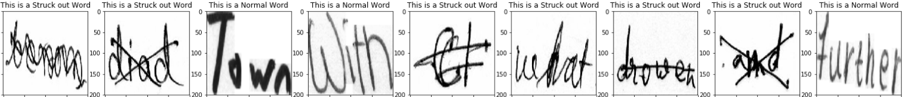
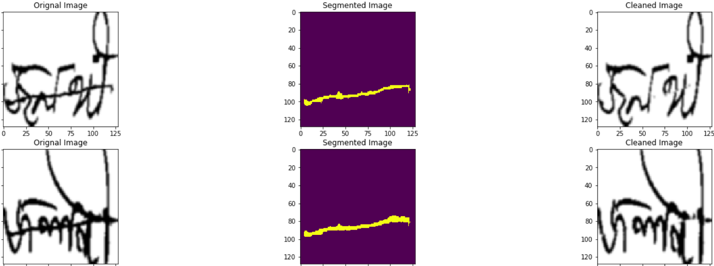
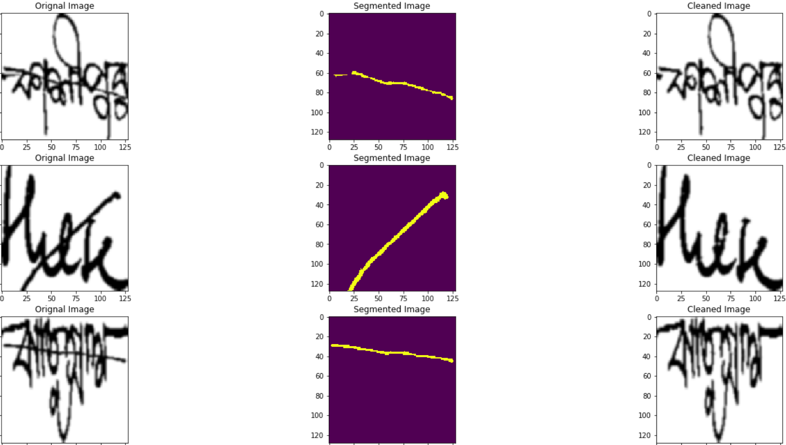

# StrikOR
This project manages the identification and processing of struck-out writings in unconstrained offline handwritten document images at word-level of three scripts viz. English, Devanagari, Bengali. 
  Whenever kept running on an OCR, such texts will deliver drivel character-string yields. We provide a solution to this problem.

#### [Motivation](https://www.sciencedirect.com/science/article/abs/pii/S003132031630190X)

## Author
- [Ankur Guria](https://www.linkedin.com/in/ankurguria/)

#### [Detailed REPORT of out project](https://github.com/ankurguria/StrikOR/blob/master/StrikOR%20PROJECT%20REPORT.pdf)

#### [CODE](https://github.com/ankurguria/StrikOR/tree/master/Code)
#### Dataset: Please send an email stating your purpose @ ankur17@iiserb.ac.in

## Observations & Results:

- In the step for the two-class classification, without any tweaking in the ResNet architecture, we have achieved an accuracy of 98.7% in the classification of struck-out words from non-struck-out words.
- In the next part to segment the struck out we faced overfitting with the original U-Net, where we got very good accuracy on the training data but the model performed very poorly on the test data. 
- To overcome this problem we tried hyperparameter tuning where we found the combination of the “Adam” optimizer, “Binary Cross Entropy” loss function, and the “Relu” activation function to work the best. Plotting the loss function against the epochs we noticed that the loss function rather than forming a convex function i.e it hasn’t nullified at a point but on a plan. This meant the gradient much before the last epoch had nullified and the model isn’t learning i.e the issue of vanishing gradient. The most sought after way to deal with this issue is “dropout”. 
- We tried adding dropout layers to various places of the U-Net architecture based on some past research works regarding the same. We found out that adding a dropout layer before the second resizing layer in each hidden layer gave the best results.
- Data Augmentation by 20% and early stopping further improved the results to stand at an F1 score of 96.2%.

## Predictions
- Detecting struck-out words:

- Strike-out segmentation:

### References:
- B.B. Chaudhuri, C. Adak, “An Approach for Detecting and Cleaning of Struck-out Handwritten Text”, Pattern Recognition, vol.61, pp.282-294, January 2017.
- Olaf Ronneberger, Philipp Fischer, Thomas Brox, “U-Net: Convolutional Networks for Biomedical Image Segmentation”, May 2015.
- Kaiming He, Xiangyu Zhang, Shaoqing Ren, Jian Sun, “Deep Residual Learning for Image Recognition”, December 2015.

